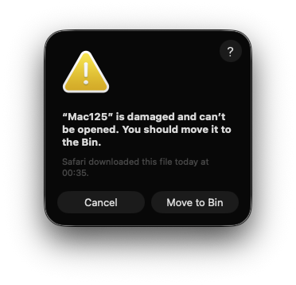

# Mac125 Releases

Official macOS release artifacts and release notes for Mac125 (no source code).

## What This Repository Contains

- macOS release artifacts (`.dmg`, `.zip`)
- release notes
- checksum files
- install and support information

## Important

- This repository does not contain source code.
- Current release builds are unsigned.

## App Packaging policy and version compatability

- `Mac125 is currently distributed directly via GitHub Releases (not through the Apple App Store).`
- `Current release testing is on a Mac Studio running macOS Tahoma 26.3, so this is the only version we can guarantee at this time, though it will likely run on other Tahoma versions as well.`
- `Due to Apple security/runtime policy differences between macOS versions, compatibility with older macOS releases may vary.`
- `Where Mac125 is compatible, it is safe to run as provided in this release.`
- `If interest grows, future releases may move to Apple Developer signing/notarization (and potentially App Store distribution).`

## Install (macOS)

1. Download the latest `.dmg` or `.zip` from Releases.
2. If using `.dmg`, open it and drag `Mac125.app` to `Applications`.
3. If using `.zip`, extract then move `Mac125.app` to `Applications`.
4. On first launch, if macOS blocks the app:
   - right-click `Mac125.app` and choose `Open`
   - confirm `Open` in the security prompt

### If macOS says the app is "damaged" or cannot be opened

Because the current release is unsigned, macOS Gatekeeper may block first launch with wording that can look like corruption. This is often a security policy/quarantine check rather than actual file damage.

This does not mean Mac125 is dead or broken. It is a macOS security warning shown before first trust is granted.



Try:

1. Move app to `Applications`, then right-click `Open`.
2. If still blocked, open:
   - `System Settings` -> `Privacy & Security`
   - find the blocked app warning and choose `Open Anyway` / `Allow Anyway`
3. If needed, run:

```bash
xattr -dr com.apple.quarantine /Applications/Mac125.app
```

## Verify Downloads

Use `SHA256SUMS.txt` to verify artifact integrity.

Example:

```bash
shasum -a 256 Mac125_v0.3.7_macos.dmg
shasum -a 256 Mac125_v0.3.7_macos.zip
```

## Support

- Email: `gw3jvb@gmail.com`
- Discord: <https://discord.gg/89BugNgZN9>

## Support Development

- PayPal.me: <https://www.paypal.com/paypalme/JohnVincentBurns>
- Buy Me a Coffee: <https://www.buymeacoffee.com/reflectingme>
